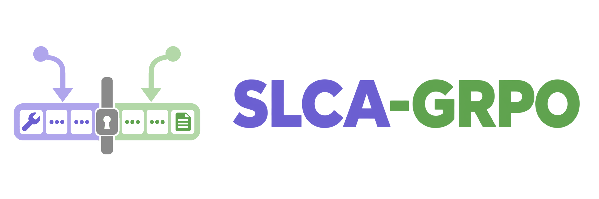
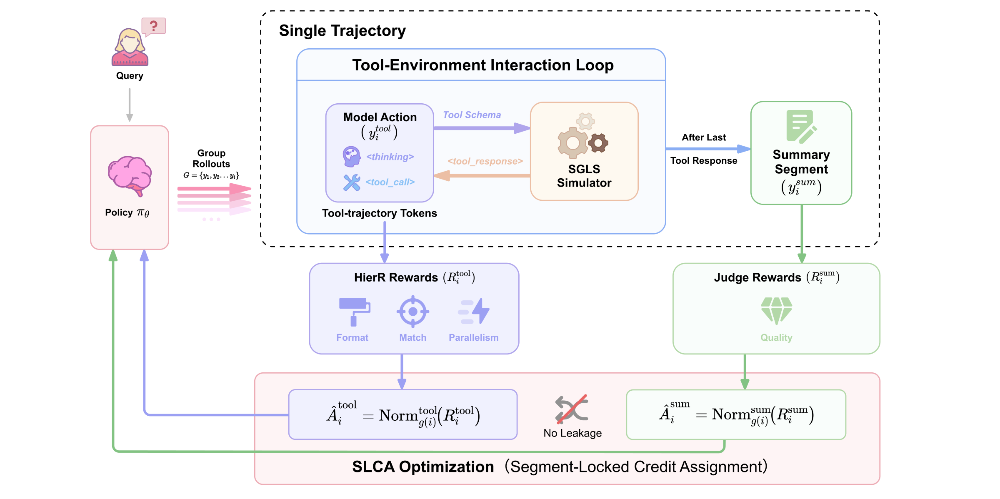
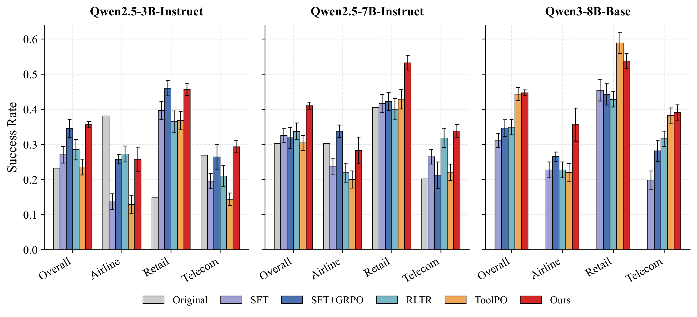
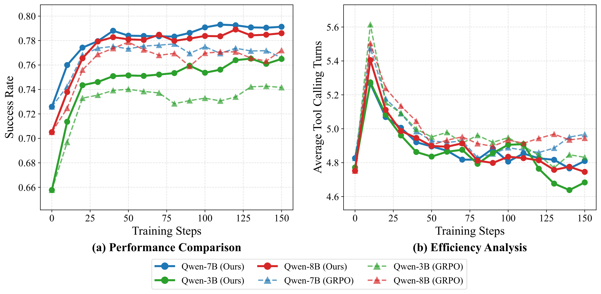
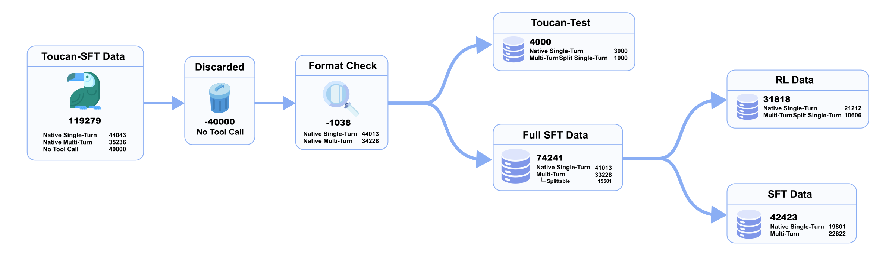
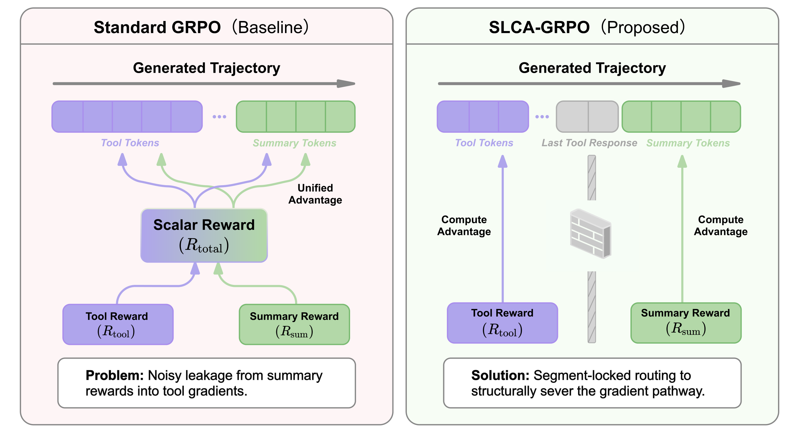

<h1 align="center"> <br>Resolving Cross-Segment Credit Misattribution in Tool-Calling RL</h1>

<div align="center">

[](https://arxiv.org/abs/2609.29050)
[](https://huggingface.co/datasets/YanZhanPKU/SLCA-GRPO-Datasets)
[](LICENSE)
[](https://www.python.org/downloads/)

</div>

<h5 align="center">If you like our project, please give us a star ⭐ on GitHub for the latest update.</h5>

<div align="center">
  
</div>

## 📣 Latest News

- **[2026-09]**: 📄 Paper released on [arXiv:2609.29050](https://arxiv.org/abs/2609.29050).
- **[2026-09]**: 🚀 Code and the four processed data splits are open-sourced — [🤗 dataset](https://huggingface.co/datasets/YanZhanPKU/SLCA-GRPO-Datasets).

## 💡 Overview

A tool-calling rollout is **heterogeneous**. It opens with a run of structured tool-call tokens and
closes with a run of free-form summary text. Standard GRPO computes **one** trajectory-level scalar
advantage and broadcasts it to every token, so reward variation from the summary half enters the
updates on tool-decision tokens — *cross-segment credit misattribution*.

**SLCA-GRPO** normalises the two segment rewards independently **within the same rollout group** and
routes each advantage only into its own tokens, blocking the summary-to-tool path *before* the
backward pass at **zero additional rollout cost**, inside a single unified policy. The only thing
that changes is the scalar attached to each token.

<p align="center">
  
</p>

Segments are read straight off the token mask verl already maintains: the **summary** segment is the
last contiguous run of policy-generated tokens, the **tool** segment is the union of everything
before it. Nothing is trained to find the boundary.

```
Â_tool = (R_tool − μ_tool) / (σ_tool + ε)        →  routed to tool tokens only
Â_sum  = (R_sum  − μ_sum ) / (σ_sum  + ε)        →  routed to summary tokens only
                                                    0 wherever the token is not learnable
```

`R_tool` is a dense process score over five components
(`0.10·fmt + 0.25·name + 0.15·key + 0.20·value + 0.30·parallel`); `R_sum` is a frozen LLM judge's
5-point rating mapped to `[0,1]`. Together these are **HierR** — you cannot route two advantages
without two rewards. Exploration during RL runs against **SGLS**, a schema-guided simulator that
stands in for live APIs.

### ✨ What makes it work

- **Segment boundaries are free.** They fall out of the existing environment-injection mask, so
  there is no segmenter to train and no annotation to collect.
- **Presence-based filtering.** A segment's statistics are computed only over the group members
  where that segment exists. If fewer than two are present the advantage is forced to 0, rather than
  falling back to `μ=0, σ=1` — that fallback would leave the raw score standing in as an
  un-normalised advantage.
- **Weights go on after normalisation.** Applying them first cancels in the idealised case, since
  `Norm(λX) = Norm(X)`; the identity holds up to the numerical floor set by `ε_norm`.
- **Omission guard.** When a task needs a tool call and no parseable call exists, the penalty is
  routed exclusively through the summary segment, and it overrides rather than subtracts.

### 📊 Overall Performance

<div align="center">
  
</div>

We evaluate across three backbones — Qwen2.5-3B-Instruct, Qwen2.5-7B-Instruct and Qwen3-8B-Base —
and three benchmarks:

- **(1) In-domain execution:** a held-out Toucan tool-calling test set, scored on name F1, argument
  matching, the dense process score, and strict Success.
- **(2) Out-of-distribution generalization:** BFCL-v3 for atomic function calling and τ²-Bench for
  long-horizon dual-control dialogue. Both bypass the LLM judge entirely.
- **(3) Estimator isolation:** SLCA-GRPO is compared against GRPO under one shared configuration —
  same SFT initialization, data partitions, simulator, rewards, decoding and group size — so the
  unified-versus-segment-locked advantage is the only thing that differs. Ablations (w/o SLCA / SGLS
  / HierR), a support control, a reward swap and two weight sweeps sit in the same run set. ToolPO
  and RLTR are reference points for the other two paradigms and keep their own protocols.

<div align="center">
  
</div>

SLCA-GRPO ends with both higher success and *fewer* tool turns than GRPO across all three backbones.

## 🔧 Installation

```bash
git clone https://github.com/SLCA-GRPO/SLCA-GRPO.git
cd SLCA-GRPO

conda create -n slca_grpo python=3.10 -y
conda activate slca_grpo

pip install -r requirements.txt
cd verl && pip install -e . --no-deps && cd -

# LLaMA-Factory is needed only for the SFT stage. Install per upstream docs, then:
export LLAMAFACTORY_DIR=<your path>
```

SFT was run on 8 × H20 and RL on 32 × H20 (4 nodes). One 8-GPU node covers SFT and evaluation, but
the two auxiliary services — the SGLS simulator and the summary judge — need serving capacity of
their own on top of that.

## 📦 Models & Data

### Model weights

> **No model weights are released.** The paper's reproducibility statement scopes its artifacts to
> code and processed splits, and states that no trained checkpoints are included. Note also that any
> checkpoint derived from **Qwen2.5-3B-Instruct** would inherit the Qwen Research License
> (non-commercial), unlike the Apache-2.0 7B and 8B backbones — see [`NOTICE`](NOTICE).

The backbones this code fine-tunes are all public:
[Qwen2.5-3B-Instruct](https://huggingface.co/Qwen/Qwen2.5-3B-Instruct),
[Qwen2.5-7B-Instruct](https://huggingface.co/Qwen/Qwen2.5-7B-Instruct) and
[Qwen3-8B-Base](https://huggingface.co/Qwen/Qwen3-8B-Base).

### Data splits

All four splits are published at
[🤗 **SLCA-GRPO-Datasets**](https://huggingface.co/datasets/YanZhanPKU/SLCA-GRPO-Datasets), derived
from [Toucan-1.5M](https://huggingface.co/datasets/Agent-Ark/Toucan-1.5M):

| File | Rows | Consumed by |
|---|---|---|
| `toucan_toolcall_sft_split_42k.parquet` | 42,423 | SFT stage of the main split protocol |
| `toucan_toolcall_sft_full_74k.parquet` | 74,241 | single-stage "SFT full" ablation |
| `toucan_toolcall_rl.parquet` | 31,818 | RL training, read by verl directly |
| `toucan_eval_4k_unified.parquet` | 4,000 | held-out in-domain eval / RL `VAL_DATA` |

BFCL-v3 and τ²-Bench are **not** shipped here — `evalscope` and the tau2 package fetch them on first
run. [`data/README.md`](data/README.md) has the schemas, the full derivation from Toucan-1.5M, and
5-row previews under `data/samples/`.

<p align="center">
  
</p>

## 🚀 Quickstart

### 1. Data

```bash
pip install -U "huggingface_hub[cli]"

huggingface-cli download YanZhanPKU/SLCA-GRPO-Datasets \
    --repo-type dataset --include "data/*.parquet" \
    --local-dir ./data --local-dir-use-symlinks False

mv ./data/data/*.parquet ./data/ && rmdir ./data/data
```

LLaMA-Factory needs the SFT parquets materialised to flat JSON; the RL and eval parquets are read by
verl as-is:

```bash
python data/convert_sft_parquet_to_json.py \
    --input data/toucan_toolcall_sft_split_42k.parquet --output data/toucan_toolcall_sft.json
python data/convert_sft_parquet_to_json.py \
    --input data/toucan_toolcall_sft_full_74k.parquet --output data/toucan_toolcall_full.json
```

### 2. SFT

```bash
MODEL_PATH=./pretrained_models/Qwen2.5-7B-Instruct \
DATA_DIR=./data \
OUTPUT_DIR=./outputs/sft_split/qwen2_5_7b_toucan_toolcall \
CONFIG_PATH=sft/qwen2_5_7b_split_sft.yaml \
bash sft/train_sft.sh
```

3B / 8B-Base / full-SFT variants: [`sft/README.md`](sft/README.md).

### 3. Auxiliary servers

Both are **frozen** — environment and reward infrastructure, never trained:

```bash
bash rl/sgls/serve_sgls_qwen3_235b.sh      # SGLS tool simulator, port 8003
bash rl/judge/serve_llm_judge_gpt_oss.sh   # summary judge, port 8016
```

### 4. RL

```bash
MODEL_PATH=./outputs/sft_split/qwen2_5_7b_toucan_toolcall \
TRAIN_DATA=./data/toucan_toolcall_rl.parquet \
VAL_DATA=./data/toucan_eval_4k_unified.parquet \
OUTPUT_DIR=./outputs/rl/qwen2_5_7b_slca_grpo \
NNODES=4 \
bash rl/slca_grpo/train_slca_grpo.sh
```

Ablations and baselines reuse this launcher with a different `algorithm.adv_estimator` and reward
function — [`ablations/README.md`](ablations/README.md), [`baselines/README.md`](baselines/README.md).

### 5. Evaluation

```bash
# In-distribution: BFCL-v3
bash eval/bfcl_v3/start_vllm_server.sh
python eval/bfcl_v3/bfcl_v3_eval.py

# OOD: tau^2-Bench (agent server + user-simulator endpoint)
bash eval/tau2_bench/start_tau2_agent_vllm_server.sh
TAU2_USER_API_BASE=... TAU2_USER_MODEL_NAME=... TAU2_USER_API_KEY=... \
  python eval/tau2_bench/tau2_bench_eval.py
```

[`eval/README.md`](eval/README.md) covers both the external-API and self-hosted user-simulator paths.

## 🗂️ Repository layout

| Path | Role |
|---|---|
| `verl/verl/trainer/ppo/core_algos.py` | **Segment-locked advantage estimator (core method)** — also holds the ToolPO variant and the presence-filtered group normaliser |
| `verl/SLCA_PATCHES.md` | every file changed relative to the vendored upstream base commit, core-algorithm vs infrastructure |
| `rl/slca_grpo/` | main launcher, the HierR reward, hydra + tool config |
| `rl/sgls/` | Schema-Guided LLM Simulator — the tool environment RL explores against |
| `rl/judge/` | frozen LLM judge behind the summary reward |
| `sft/` | SFT stage: LLaMA-Factory YAMLs + launcher, 3B / 7B / 8B-Base + full-SFT |
| `data/` | data card, schema previews, split converters, LLaMA-Factory registration |
| `baselines/toolpo/`, `baselines/rltr/` | contextual baselines, each on its own protocol |
| `ablations/` | w/o SLCA, w/o SGLS, w/o HierR, w/o Parallel Reward |
| `analysis/hierr_sweep/` | HierR process-weight sweep |
| `analysis/execution_reward/` | the execution-based reward swap |
| `analysis/grad_cosine/` | the gradient-orthogonality probe |
| `eval/bfcl_v3/`, `eval/tau2_bench/` | the two out-of-distribution benchmarks |
| `tests/`, `verl/tests/trainer/ppo/` | reward-function samples and the CPU estimator suite |

## ⚙️ Key configuration

| Stage | Knob | Default | Effect |
| :--- | :--- | :--- | :--- |
| RL | `algorithm.adv_estimator` | `slca_grpo` | segment-locked routing; `grpo` gives the w/o-SLCA condition |
| RL | `algorithm.norm_adv_by_std_in_grpo` | `true` | per-group std normalisation |
| RL | `actor_rollout_ref.actor.policy_loss.loss_mode` | `vanilla` | held fixed across every method, so the policy-loss implementation is not a variable |
| RL | `SLCA_WEIGHT_{FORMAT,NAME,KEY,VALUE,PARALLEL}` | `0.10 / 0.25 / 0.15 / 0.20 / 0.30` | HierR process-reward weights |
| RL | `SLCA_WEIGHT_{PROCESS,RESPQ}` | `1.0 / 1.0` | tool vs summary weighting, applied after normalisation |
| RL | `LLM_JUDGE_BASE_URL` / `LLM_JUDGE_MODEL` | `127.0.0.1:8016` / `gpt-oss-120b` | summary-reward backend |
| Rollout | `multi_turn.{max_assistant_turns,max_parallel_calls}` | `10 / 20` | tool-loop caps |

**Version pins.** Reproduction depends on the frozen services as much as on the code: verl
`0.7.0.dev` (vendored), vLLM `0.11.0`, evalscope `1.3.0`, tau2 `v0.2.1.dev0` (from the `@v0.2.0`
tag). The frozen models are Qwen3-235B-A22B-Instruct-2507 (SGLS simulator), GPT-OSS-120B (summary
judge, and the alternate response mocker), DeepSeek-V3.2 (τ² user simulator) and Qwen3-30B-A3B
(RLTR completeness checker). Swapping a judge or simulator changes the reward distribution, and the
numbers will not match.

## 🔬 Reproducing the paper

**Run the estimator tests first.** The CPU suite in `verl/tests/trainer/ppo/` exercises the segment
split, the presence filter, the post-normalisation weighting identity and the omission guard without
a GPU — it is the fastest way to confirm the vendored verl is patched correctly:

```bash
cd verl && python -m pytest tests/trainer/ppo/test_slca_grpo_on_cpu.py -q
```

**Keep the protocol attached to the number.** Every headline gap is measured between SFT+GRPO and
SLCA-GRPO under one shared configuration. Numbers from `baselines/` come from those baselines' own
initialisation and reward protocols and are not interchangeable with them. The same applies within
ToolPO: its two outcome rewards put the same estimator tens of points apart — see
[`baselines/README.md`](baselines/README.md) before quoting any ToolPO figure.

**Multiple runs, not a single one.** Every trained entry in the paper is a mean ± std over three
independent runs. A single run will land inside that spread rather than on the reported mean; the
τ²-Bench numbers in particular carry the widest variance.

**The frozen services are part of the protocol.** SGLS, the summary judge, the τ² user simulator and
the alternate response mocker are all frozen models, pinned in the version table above. Swapping any
of them changes the reward or evaluation distribution, and the absolute numbers will move even
though the code has not.

<p align="center">
  
</p>

## ⚠️ Known limitations

- **Segment decomposition assumes a boundary.** Settings without a clean split between structured
  calls and free-form text — inline code generation, for instance — would need a learned segmenter.
- **The process reward matches against gold trajectories**, so it can under-reward a valid
  alternative tool plan, and Success@0.9 thresholds that same score rather than an independent
  task-outcome label. `analysis/execution_reward/` is the complementary formulation.
- **The w/o-SLCA contrast moves two things at once.** It changes both the normalisation and the
  token support, so it measures the combined estimator change rather than either operation alone.
- **Intra-tool temporal credit is untouched.** One scalar goes to every tool token, so a correct
  first action and a failing second one are not distinguished. SLCA is complementary to
  VinePPO/GiGPO/SPO rather than a replacement, but the combination is untested.
- **`Â_sum` carries a summary-side grouping bias**, confined to summary tokens. Explicit subgrouping
  would shrink the effective group size exponentially — this is a deliberate trade-off.
- **Up to 8B, Qwen-family only, exploration against a simulator.** Larger-scale training and direct
  real-API comparison are future work.
- **Benchmark-dependent ordering.** The relative ordering against the reference baselines depends on
  the domain and the protocol.

## 📄 Citation

```bibtex
@article{zhan2026slcagrpo,
  title   = {SLCA-GRPO: Resolving Cross-Segment Credit Misattribution in Tool-Calling RL},
  author  = {Zhan, Yan and Liu, Shaobo and Liu, Qiunan and Shi, Yuanjun and
             Xu, Siqi and Hou, WeiYi and Xu, Xiang and Li, Zekang and
             Pan, Weizhou and Yan, Jiahong},
  journal = {arXiv preprint},
  year    = {2026},
  eprint  = {2609.29050},
  archivePrefix = {arXiv},
  primaryClass  = {cs.AI},
  url     = {https://arxiv.org/abs/2609.29050}
}
```

## 🙏 Acknowledgements

Peking University · Shenzhen University · Tencent PCG QQ Team.

Built on [verl](https://github.com/volcengine/verl), [Toucan-1.5M](https://huggingface.co/datasets/Agent-Ark/Toucan-1.5M),
[BFCL / Gorilla](https://github.com/ShishirPatil/gorilla), [τ²-Bench](https://github.com/sierra-research/tau2-bench)
and [EvalScope](https://github.com/modelscope/evalscope). Full attribution and the license of every
model this code loads are in [`NOTICE`](NOTICE).

## 📜 License

Code in this repository is released under the [Apache License 2.0](./LICENSE). The published splits
are derived from [Toucan-1.5M](https://huggingface.co/datasets/Agent-Ark/Toucan-1.5M) and remain
subject to its terms; each model this code loads keeps its own license, listed in [`NOTICE`](NOTICE).

## 📮 Contact

Questions and issues are welcome via [GitHub Issues](https://github.com/SLCA-GRPO/SLCA-GRPO/issues),
or contact `josephpan@tencent.com`.
